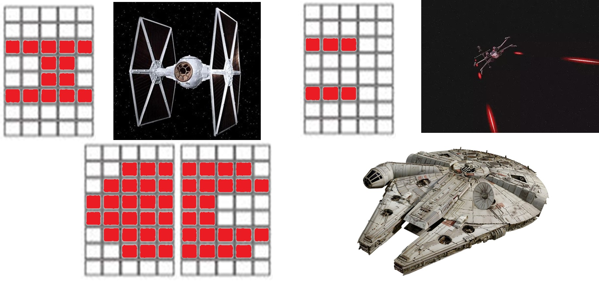
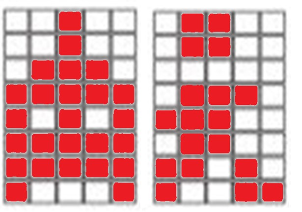
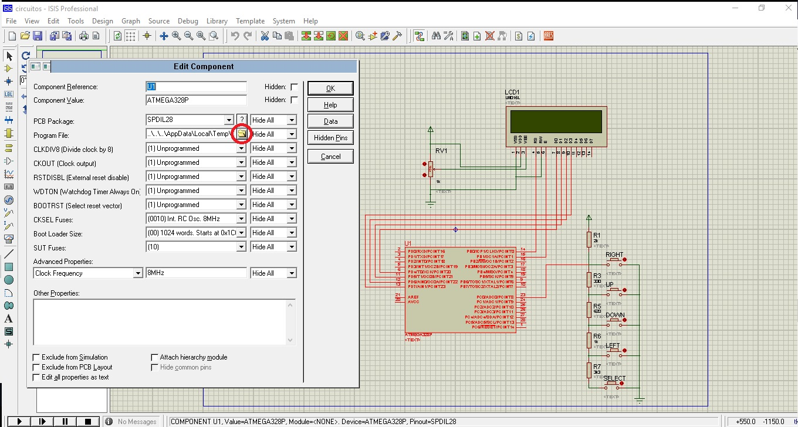

# Hands-on de arduino - Star Wars game

Códigos desenvolvidos para um Hands-on de Arduino ministrado por mim, oferecido e divulgado pela Empresa Júnior da Engenharia Mecatrônica-IFSC.

## Bibliotecas

### StarWars
Essa biblioteca contém um código simples que dinamiza a movimentação nas duas linhas do display de LCD, permitindo mais de duas posições pra nave.
Seus exemplos de funcionamento é o código exemplo 3 e 4.

### StarWarsFull
Biblioteca que possue as funções anteriores e também cria naves inimigas e lida com os tiros da nave, acertar os tiros nos inimgos, marca pontos e verifica o fim do jogo.
O exemplo de funcionamento é o código exemplo 5.

### Caracteres das bibliotecas

Figura 1 - Caracteres criados

## Códigos de exemplo

Este repositório contém códigos de exemplo para utilização do shield arduino da figura figura 1. Os códigos estão em nível de complexidade.

Figura 2 - Shield LCD

### Código exemplo 1
Código básico que inicializa o display, imprime "Hello world!" na tela e permite movimentação do mesmo com os botões.

### Código exemplo 2
Exemplo que cria um caracter e salva na memória do display para manipula-lo na tela.

Figura 3 - Caracteres sugeridos no exemplo

### Código exemplo 3
Esse exemplo requer a instalação da biblioteca disponível nesse repositório, basta instalar na pasta libraries do arduino, geralmente na pasta documentos

### Código exemplo 4
Aprimoramento do exemplo 3 com a utilização de uma função para deixar o código mais limpo.

### Código exemplo 5
Para utilizar esse exemplo, é necessário instalar a biblioteca StarWarsFull. Esse exemplo tem como função mostrar como bibliotecas mais completas e complexas podem facilitar a programação, mas causar erros que são difíceis de debugar sem um conhecimento considerável de como funcionam, além de limitar as operações disponíveis.
A biblioteca contém bugs propositais como tiros atravessando as naves inimigas que não podem ser corrigidos no código do arduino.

### Código sem biblioteca
Código criado inicialmente para gerar as bibliotecas. Contém alguns bugs, pois deixa-lo perfeito não era o foco. Sinta-se livre para contribuir e corrigi-los.

## Utilização do proteus
Caso você não tenha a shield e/ou um arduino, é possível utilizar o código no projeto do proteus 7.1.
Basta compilar o projeto e copiar o endereço da pasta temporária gerada na compilação, é possível ve-la em vermelho nas informações de compilação. Adicione o arquivo hex desta pasta no local indicado na figura 4.

Figura 4 - Utilizando o arduino no proteus

### To-do:
- Corrigir bugs na biblioteca StarWarsFull;
- Corrigir bugs no código "StarWarsSBiblioteca".

### Como contribuir:

1. Crie um Fork.
2. Para trabalhar em uma proposta, crie um branch (`git checkout -b proposta_x`)
3. Commit (`git commit -m "Descrição da proposta"`)
4. Push para o branch da proposta (`git push origin proposta_x`)
5. Abra uma [Pull Request]
6. Vá fazer outra coisa.